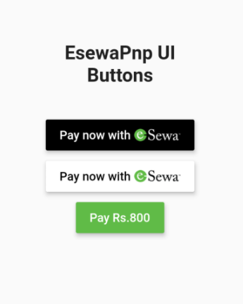

# esewa_pnp

<!-- ALL-CONTRIBUTORS-BADGE:START - Do not remove or modify this section -->

[](#contributors-)

<!-- ALL-CONTRIBUTORS-BADGE:END -->

[](https://github.com/zepfietje/starware) [](https://pub.dartlang.org/packages/esewa_pnp)

**esewa_pnp** is flutter plugin that let's developer to integrate native [eSewa](https://www.esewa.com.np) payment method into their flutter application with just few lines of code.

## How to install

- Depend on it

  ```yaml
  dependencies:
  	esewa_pnp: ^2.0.1
  ```

- [Android] Add following attribute inside your AndroidMainfest.xml

  ```xml
   <application
      ...
      android:theme="@style/Theme.AppCompat.Light.NoActionBar"
      ...>
  ...
  </application>

  ```

- [iOS] **esewa_pnp** (version ^1.0.0) iOS can not be tested on simulator. For that you will need to depend on plugin from plugin's GitHub repository "dev" branch.

  ```yaml
  dependencies:
  	# esewa_pnp: ^2.0.1 # Use it on production app or while testing esewa_pnp on real physical iOS device.
  	esewa_pnp:
  		git:
  			url: git://github.com/ayyshim/esewa_pnp.git
  			ref: dev
  ```

## Usage

1. Create a **ESewaConfiguration** object. Start with test environment. When application is ready, you can switch it to live (ENVIRONMENT_LIVE)

```dart
...

ESewaConfiguration _configuration = ESewaConfiguration(
    clientID: "<Client-ID>",
    secretKey: "<Secret-Key>",
    environment: ESewaConfiguration.ENVIRONMENT_TEST //ENVIRONMENT_LIVE
);
...
```

> `clientID` and `secretKey` values are provided by eSewa to its merchant/client and is unique for each. For development phase, you can use the following credentials:
>
> `clientID:` "JB0BBQ4aD0UqIThFJwAKBgAXEUkEGQUBBAwdOgABHD4DChwUAB0R"
>
> `secretKey:` "BhwIWQQADhIYSxILExMcAgFXFhcOBwAKBgAXEQ=="

2. Create **ESewaPnp** object and pass configuration.

```
...
ESewaPnp _eSewaPnp = ESewaPnp(configuration: _configuration);
```

3. Finally create the payment object

```dart
...
ESewaPayment _payment = ESewaPayment(
    amount: <ANY_DOUBLE_VALUE>,
    productName: "<Product-Name>",
    productID: "<Unique-Product-ID>",
    callBackURL: "<Call-Back-URL>"
);
...
```

4. Now call `initPayment` method.

```dart
...
final _res = await _eSewaPnp.initPayment(payment: _payment);
...
```

5. Determine application behavior according to the response. Wrap the `.initPayment` method inside try-catch block.

```dart
...
try {
	final _res = await _eSewaPnp.initPayment(payment: _payment);
	// Handle success
} on ESewaPaymentException catch(e) {
	// Handle error
}
...
```

## ESewaPaymentException

**ESewaPaymentException** class is thrown when payment process fails.

- `.message` [String] : returns the error message

###

## ESewaResult

**ESewaResult** is returned when payment process successful.

- `.message` [String] : returns readable success message
- `.productId` [String] : returns product id of the product customer paid for
- `.productName` [String] : returns product name of the product customer paid for
- `.totalAmount` [String] : returns total amount customer paid
- `.date` [String] : returns the date of transaction
- `.status` [String] : returns the transaction status
- `.referenceId` [String] : returns the transaction reference id

## ESewaPaymentButton

**ESewaPaymentButton** is a customizable button widget. It takes `ESewaPnp`, 6 required named parameters and 8 optional parameters.

To use this button you must [download assets](https://drive.google.com/file/d/1T8M8yRh3x2BTs6xUwYkt2uH0x_AyfaBI/view?usp=sharing) and paste it inside your `assets` folder of your project.
Add following line inside your pubspec.yaml file too.

```yaml
  ...
  flutter:
    assets:
      - assets/esewa/
  ...
```

Example #1 (Default):

```dart
  ...
  ESewaPaymentButton(
    _esewaPnp,
    amount: 800.0,
    callBackURL: "https://example.com",
    productId: "abc123",
    productName: "ESewa Pnp Example",
    onSuccess: (ESewaResult result) {
      // Do something with Result
    },
    onFailure: (ESewaPaymentException e) {
      // Do something with Error
    },
  ),
  ...
```

Example #2 (White background):

Changing button color will also result to dyanmically change in label color and esewa logo varient (dark/light).

```dart
  ...
  ESewaPaymentButton(
    _esewaPnp,
    amount: 800.0,
    callBackURL: "https://example.com",
    productId: "abc123",
    productName: "ESewa Pnp Example",
    onSuccess: (ESewaResult result) {
      // Do something with Result
    },
    onFailure: (ESewaPaymentException e) {
      // Do something with Error
    },
    color: Color(0xFFFFFFF), // White background
  ),
  ..
```

Example #3 (with labelBuilder):

```dart
  ...
  ESewaPaymentButton(
    _esewaPnp,
    amount: 800.0,
    callBackURL: "https://example.com",
    productId: "abc123",
    productName: "ESewa Pnp Example",
    onSuccess: (ESewaResult result) {
      // Do something with Result
    },
    onFailure: (ESewaPaymentException e) {
      // Do something with Error
    },
    color: Color(0xFF60BB47), // Green background
    labelBuilder: (int amount, Widget esewaLogo) {
      return Text("Pay Rs.$amount");
    }
  ),
  ..
```

Output:


# Platform Support

| Platform | Status |
| :------- | :----- |
| Android  | ✅     |
| iOS      | ✅     |

## 👨‍🦱 Author

**[Ashim Upadhaya](https://www.github.com/ayyshim)**

Checkout example implementation : [EsewaPnp Example](https://github.com/ayyshim/esewa_pnp/tree/master/example)

## 🌟 Starware

esewa_pnp is Starware.  
This means you're free to use the project, as long as you star its GitHub repository.

## Contributors ✨

Thanks goes to these wonderful people ([emoji key](https://allcontributors.org/docs/en/emoji-key)):

<!-- ALL-CONTRIBUTORS-LIST:START - Do not remove or modify this section -->
<!-- prettier-ignore-start -->
<!-- markdownlint-disable -->
<table>
  <tr>
    <td align="center"><a href="http://httlp://aawaz.com.np"><br /><sub><b>Aawaz Gyawali</b></sub></a><br /><a href="https://github.com/ayyshim/esewa_pnp/commits?author=awazgyawali" title="Code">💻</a></td>
    <td align="center"><a href="https://bibek-timsina.com.np/"><br /><sub><b>Bibek Timsina</b></sub></a><br /><a href="https://github.com/ayyshim/esewa_pnp/commits?author=bimsina" title="Code">💻</a></td>
    <td align="center"><a href="https://github.com/735l4"><br /><sub><b>Pratibimba Khadka</b></sub></a><br /><a href="https://github.com/ayyshim/esewa_pnp/commits?author=735l4" title="Code">💻</a></td>
    <td align="center"><a href="https://github.com/aarjan"><br /><sub><b>Aarjan Baskota</b></sub></a><br /><a href="https://github.com/ayyshim/esewa_pnp/commits?author=aarjan" title="Code">💻</a></td>
    <td align="center"><a href="https://bitpointx.com.au"><br /><sub><b>Bikram Aryal</b></sub></a><br /><a href="https://github.com/ayyshim/esewa_pnp/commits?author=aryalg" title="Code">💻</a></td>
  </tr>
</table>

<!-- markdownlint-restore -->
<!-- prettier-ignore-end -->

<!-- ALL-CONTRIBUTORS-LIST:END -->

This project follows the [all-contributors](https://github.com/all-contributors/all-contributors) specification. Contributions of any kind welcome!
